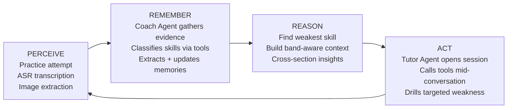
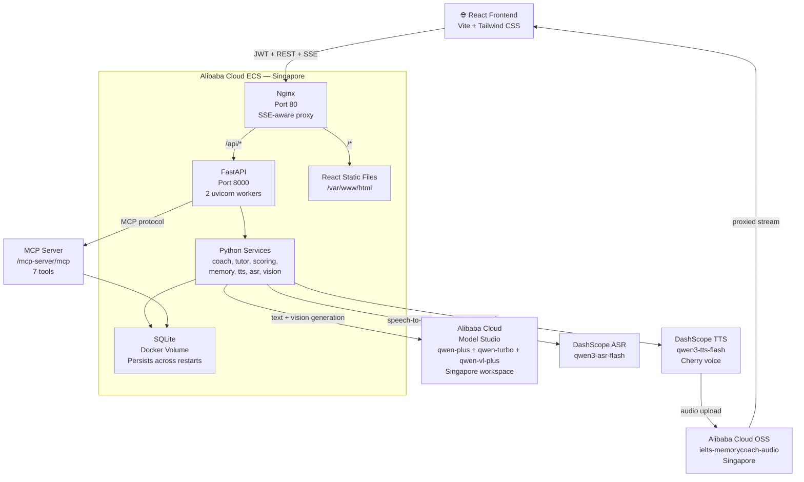
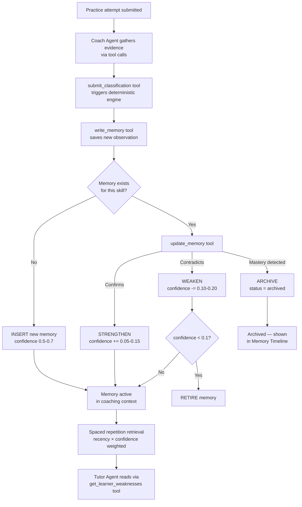
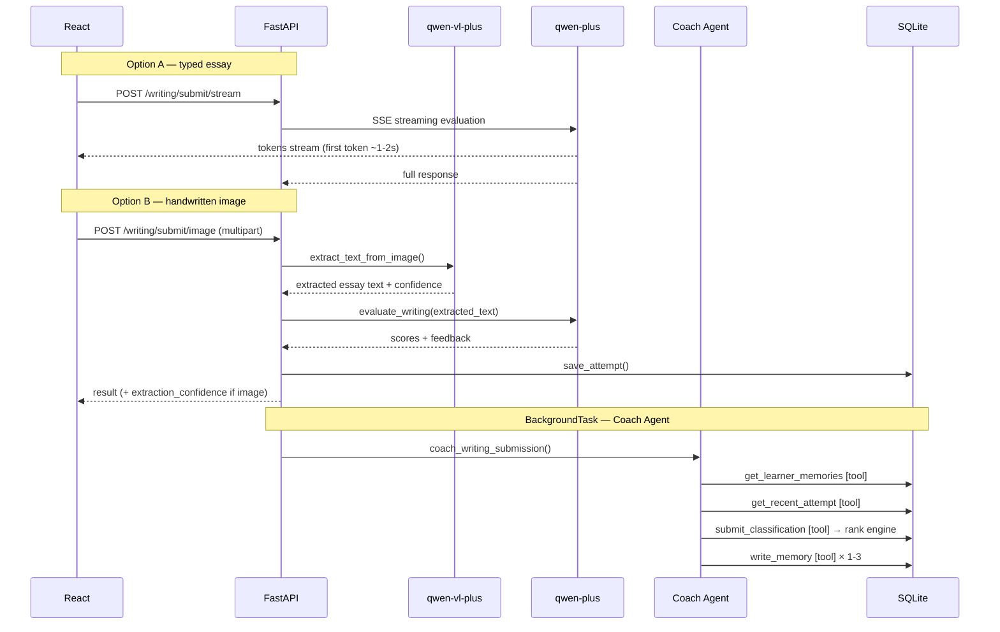
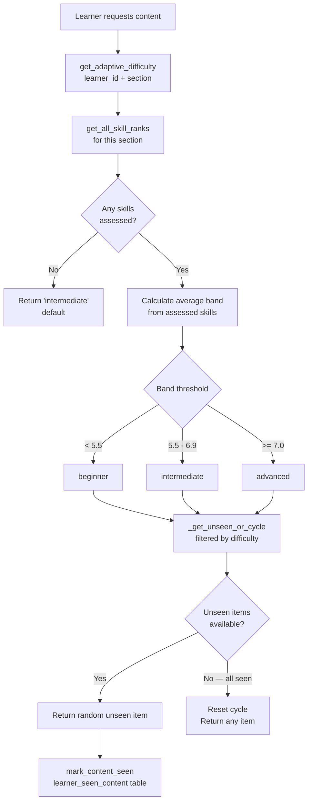
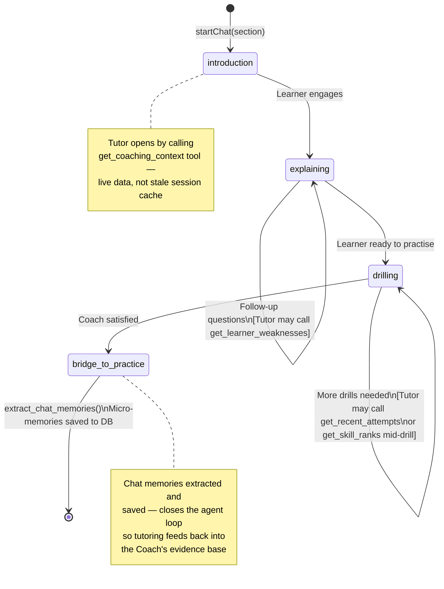
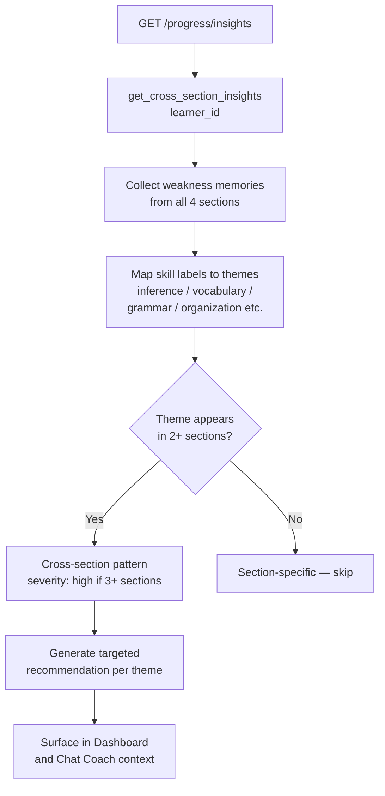
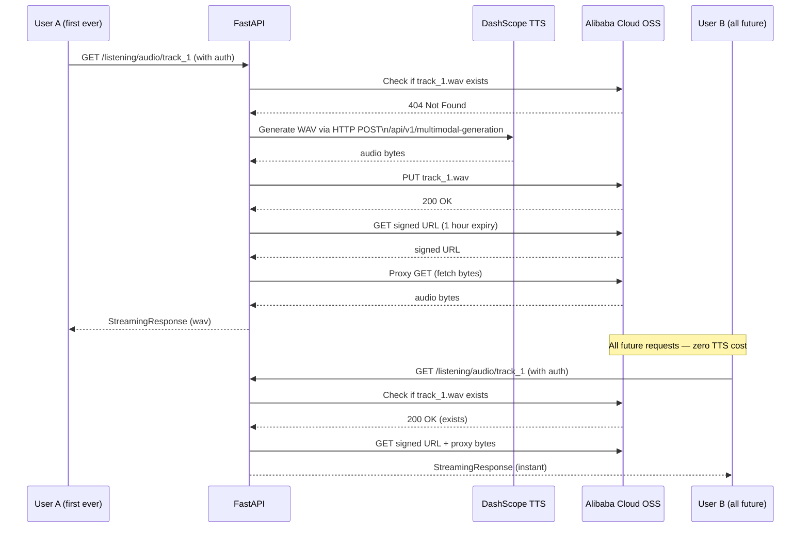
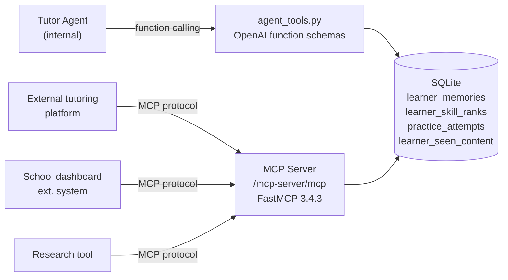

# IELTS MemoryCoach — Architecture

## The Agent Loop

MemoryCoach implements a full **perceive → remember → reason → act**
agent loop that runs after every practice session.



---

## System Architecture



---

## Coach / Tutor Agent Architecture

MemoryCoach implements two distinct AI agents with a clean boundary:
the Coach writes learner data, the Tutor reads it.


**Tool definitions** live in `app/services/agent_tools.py` as
OpenAI-compatible function schemas, executed by `execute_coach_tool()`
and `execute_tutor_tool()`. Qwen's function calling API decides when
to call each tool based on the conversation context.

---

## Memory Lifecycle



**Spaced repetition weighting:** `get_relevant_memories()` scores each
memory as `confidence × recency_weight` where recency decays from 1.0
(updated within 7 days) to 0.4 (older than 90 days). Recent evidence
outweighs stale evidence regardless of confidence level.

---

## Writing Submission — Coach Agent Pipeline

The old three-call chain (evaluate → classify → extract) is now
orchestrated by the Coach agent, which gathers evidence via tools
before making classification and memory decisions.



---

## Adaptive Content Selection

All four sections select content matched to the learner's
current band level, avoiding content already seen.



---

## Band Estimation System

IELTS band estimates (4.0–8.5) replace the internal 1-5 rank
for all learner-facing displays. The rank engine is unchanged —
bands are derived at read time from rank + streak.

```
Rank 1, streak 0 → Band 4.0   Rank 1, streak 1+ → Band 4.5
Rank 2, streak 0 → Band 5.0   Rank 2, streak 1+ → Band 5.5
Rank 3, streak 0 → Band 6.0   Rank 3, streak 1+ → Band 6.5
Rank 4, streak 0 → Band 7.0   Rank 4, streak 1+ → Band 7.5
Rank 5, streak 0 → Band 8.0   Rank 5, streak 1+ → Band 8.5

No band shown until total_evidence > 0 (first practice session)
A weakness resets streak to 0, dropping band back to base within
the rank — providing realistic downward movement without touching
the underlying rank engine.
```

Section band = average of all assessed skill bands for that section.
Overall band = average of all section bands with any evidence.

---

## Specialist Tutor State Machine

Each of the 4 specialist tutors follows the same state machine.
The Tutor is now a tool-calling agent — it can query live learner
data mid-conversation rather than relying solely on static context.



---

## Cross-Section Insights



---

## OSS Audio Architecture

Listening track audio is generated once globally and
proxied to the browser via FastAPI (direct redirect cannot
be used because browsers reject cross-origin redirects
when an Authorization header is present).



TTS quota consumed **once per track** for all users for all time.
Currently 9 tracks = 9 TTS calls total regardless of user count.

---

## MCP Server

The memory layer is exposed as an MCP server — any
MCP-compatible agent can query learner coaching data.
The Tutor agent also calls these tools internally via
OpenAI function calling (not MCP protocol).



**Available tools:**
- `get_coaching_context` — full context bundle (primary tool for AI agents)
- `get_learner_weaknesses` — active weakness memories with confidence
- `get_learner_strengths` — active strength memories
- `get_skill_ranks` — all skill ranks with band estimates and streak data
- `get_weakest_skill_for_learner` — single weakest skill + rank definitions
- `get_recent_attempts` — attempt history with score summaries
- `get_learner_memory_stats` — memory profile statistics

---

## Database Schema

```
users
  user_id, email, username, password_hash
  google_id, auth_provider, learner_id
  is_active, created_at, last_login

learners
  learner_id, name, target_score
  test_date, current_focus

practice_attempts
  attempt_id, learner_id, section, task_type
  prompt, learner_response, score_json
  feedback, created_at

learner_memories              ← The Coach Agent's core evidence store
  memory_id, learner_id, section, skill
  memory_type (weakness/strength)
  memory_text, confidence (0.0-1.0)
  evidence_count, status (active/archived)
  created_at, updated_at
  ← Retrieval weighted by recency × confidence (spaced repetition)

learner_skill_ranks           ← Deterministic rank engine store
  rank_id, learner_id, section, skill_id
  current_rank (1-5), clean_streak (0-2)
  total_evidence, last_classification
  created_at, updated_at
  ← Band (4.0-8.5) derived at read time from rank + streak

learner_seen_content          ← Adaptive content deduplication
  seen_id, learner_id, section
  content_id (passage_id / prompt_id / track_id)
  seen_at
  ← Ensures adaptive selection serves unseen content first;
    cycles back only when all items at current difficulty exhausted

mastery_scores
  Section-level score history

session_summaries
  Session-level summaries
```

---

## Key Design Decisions

### 1. Coach/Tutor separation
Two agents with a clean boundary: **Coach writes, Tutor reads**.
The Coach evaluates practice submissions, classifies skills via
`submit_classification`, and writes memories via `write_memory`.
The Tutor reads learner data via read-only tools and never writes
ranks or memories directly. This boundary is enforced by separate
tool schemas (`COACH_TOOL_SCHEMAS` vs `TUTOR_TOOL_SCHEMAS`).

### 2. Deterministic rank engine beneath the Coach agent
The Coach agent makes AI judgements (classify this skill as
strength/weakness), but rank changes are always decided by the
deterministic engine (3 consecutive strengths = rank up). The AI
judges the evidence; the engine enforces the rules. Rank changes
are fully auditable — inspect `learner_skill_ranks` to see exactly
why any rank moved.

### 3. Three separate Qwen calls per Writing submission
Isolation by design. Essay evaluation (qwen-plus), skill
classification (qwen-turbo), and memory extraction (qwen-plus)
are separate. Long feedback contains apostrophes that break JSON
parsing; short classification responses are reliable. One failure
cannot cascade.

### 4. Task-tiered model routing
```
qwen-plus     → complex reasoning (essay evaluation, memory
                 extraction, Coach agent, Tutor agent)
qwen-turbo    → structured output (skill classification,
                 JSON repair) — faster, cheaper, sufficient
qwen-vl-plus  → vision (handwritten essay image extraction)
```

### 5. OSS for audio
Listening track audio is generated once globally.
Every learner gets it proxied from Alibaba Cloud OSS instantly.
TTS quota consumed exactly once per track for all users for all time.

### 6. MCP as the memory API
The memory layer is infrastructure, not just an app feature.
Any MCP-compatible agent can query learner coaching history via
standard protocol. Internally, the Tutor agent uses the same
functions via OpenAI function calling rather than MCP protocol —
same data, two consumption patterns.

### 7. SSE streaming for essay feedback
The learner sees the first feedback token in ~1-2 seconds
instead of waiting 15-20 seconds. FastAPI StreamingResponse
with Nginx `proxy_buffering off` ensures tokens flow
through to the browser without buffering.

### 8. Adaptive content with seen-content deduplication
All four sections select content matched to the learner's average
band. `learner_seen_content` tracks which items have been served
so the same passage/prompt/track is never repeated until all
items at the current difficulty level have been exhausted.

### 9. Spaced repetition in memory retrieval
`get_relevant_memories()` weights memories by `confidence ×
recency_weight`. A memory updated last week outranks a
higher-confidence memory from three months ago — matching
the spaced repetition principle that recent evidence is more
predictive of current ability.
