# Qonda IELTS — Architecture

## The Pedagogical Skill Layer

> Full detail in [`docs/pedagogy_framework.md`](docs/pedagogy_framework.md)

Between the Tutor's reasoning and its response generation sits a
**deterministic pedagogy layer** (`app/pedagogy/`). The learner model
identifies *what* needs improvement; the Pedagogy Planner determines
*how* it should be taught.

> Python selects the teaching method; Qwen generates and delivers the teaching.

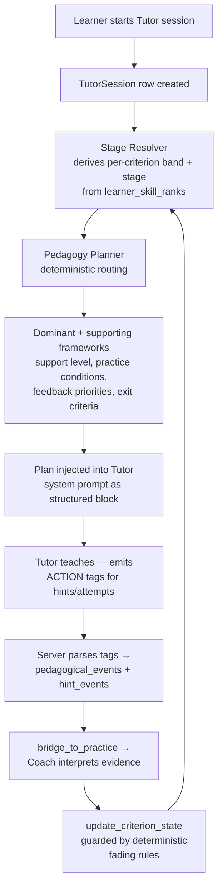

**Key components**

| Component | File | Role |
|---|---|---|
| Framework registry | `app/data/pedagogical_frameworks.json` + `pedagogy/registry.py` | 16 frameworks (4/section) with roles per stage (dominant/supporting/faded/retired) + the 4-habit Shared Spine |
| Band descriptors | `app/data/band_descriptors.json` + `pedagogy/descriptors.py` | Backward Design anchors — every activity targets a specific descriptor |
| Stage resolver | `pedagogy/stage_resolver.py` | Derives criterion bands/stages live from skill ranks (never stored — single source of truth) |
| Planner | `pedagogy/planner.py` | Deterministic routing tables per section; builds and persists the session plan |
| Practice conditions | `pedagogy/session_policy.py` | Binary gates: timed/untimed, replay limits, transcript policy, revision-required |
| Action tags | `pedagogy/action_tags.py` | `[ACTION: hint level=2]` etc. — how the app records what happened inside freeform chat |
| Spine validator | `pedagogy/spine.py` | Soft Feedback-Triad check with one retry, then log-only |
| Fading rules | `pedagogy/fading.py` | Support reduction must be earned (≥3 successes, avg hint ≤1.0, accuracy ≥0.8); restoration always allowed; one step at a time |
| Evidence store | `services/pedagogical_event_service.py` | tutor_sessions, tutor_session_plans, pedagogical_events, hint_events |
| Coach interpretation | `coach_service.coach_tutor_session()` | Runs at bridge_to_practice; the Tutor records what happened, the Coach decides what it means |

**Learner stages** (tracked per criterion, not per section):
Foundations (≤5.5, knowledge) → Guided Control (6.0, consistency) →
Independent Control (6.5–7.0, exam control) → Automatization (7.5+, precision).

---

## The Agent Loop

Qonda IELTS implements a full **perceive → remember → reason → act**
agent loop that runs after every practice session.

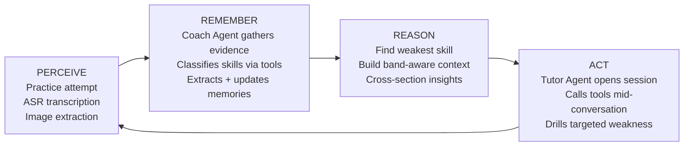

---

## System Architecture

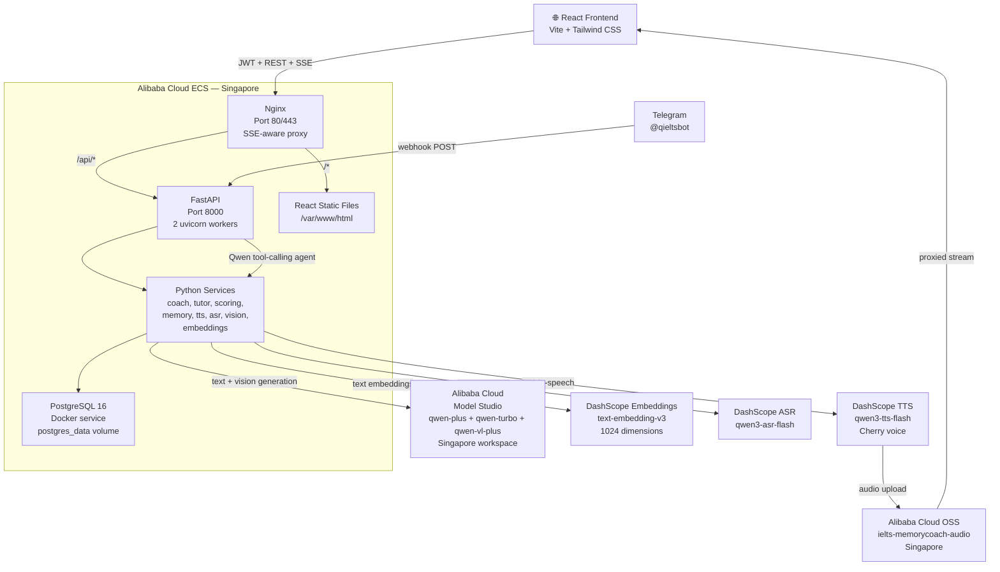

### Docker service topology (dev + prod)

```
docker-compose.yml (dev)             docker-compose.prod.yml (prod)
─────────────────────────────────    ────────────────────────────────────
postgres:16-alpine                   postgres:16-alpine
  └─ postgres_data volume              └─ postgres_data volume
                                         (persists across rebuilds)
api (FastAPI + app/)                 app (Nginx + FastAPI in one image)
  └─ depends_on: postgres healthy      └─ depends_on: postgres healthy
  └─ DATABASE_URL → postgres           └─ DATABASE_URL → postgres

frontend (node:20-alpine dev)        (React built into static files
  └─ Vite dev server :5173              served by Nginx at /var/www/html)
```

Both environments resolve `DATABASE_URL` from the environment, so the
`app/db/database.py` layer is identical — only the connection string changes.

---

## Coach / Tutor Agent Architecture

Qonda IELTS implements two distinct AI agents with a clean boundary:
the Coach writes learner data, the Tutor reads it.

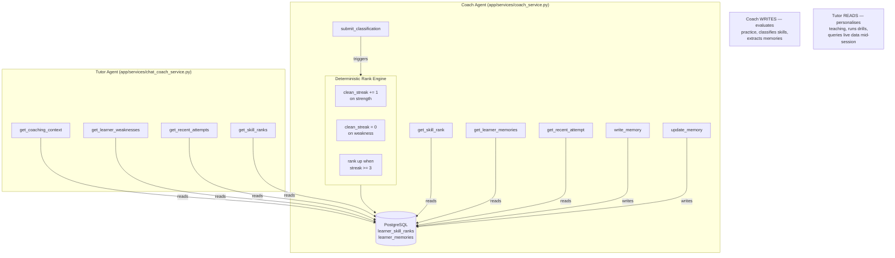

**Tool definitions** live in `app/services/agent_tools.py` as
OpenAI-compatible function schemas, executed by `execute_coach_tool()`
and `execute_tutor_tool()`. Qwen's function calling API decides when
to call each tool based on the conversation context.

---

## Memory Lifecycle

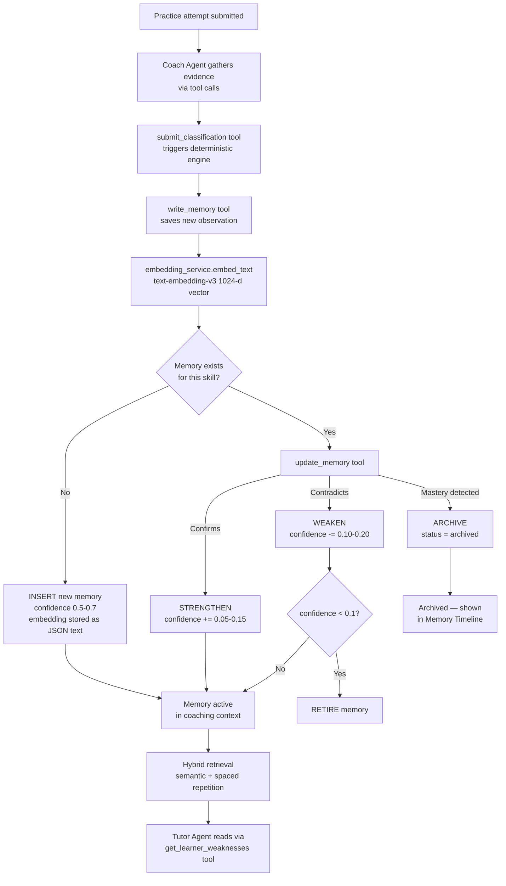

**Hybrid retrieval:** `get_relevant_memories()` accepts an optional `context`
string. When provided (e.g. the target band descriptor from the session plan),
it embeds the context and re-ranks memories using:

```
score = 0.45 × cosine_similarity(context_embedding, memory_embedding)
      + 0.55 × spaced_repetition_score
```

where `spaced_repetition_score = confidence × recency_weight` and recency
decays from 1.0 (≤7 days) to 0.4 (>90 days). When no context is provided
(e.g. tool calls with no session context) pure spaced repetition is used.
Embeddings are computed on write via `app/services/embedding_service.py`
and stored as JSON text in the `embedding` column; cosine similarity is
computed in Python with numpy — no pgvector extension required.

---

## Writing Submission — Coach Agent Pipeline

The old three-call chain (evaluate → classify → extract) is now
orchestrated by the Coach agent, which gathers evidence via tools
before making classification and memory decisions.

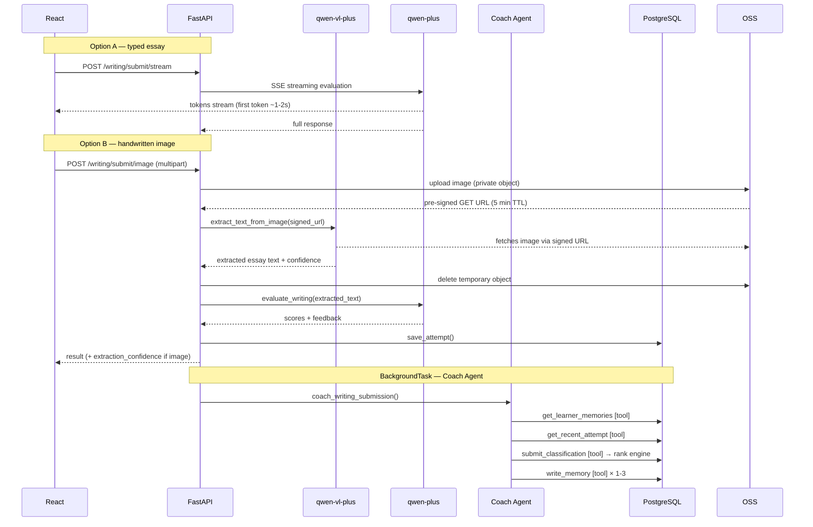

---

## Adaptive Content Selection

All four sections select content matched to the learner's
current band level, avoiding content already seen.

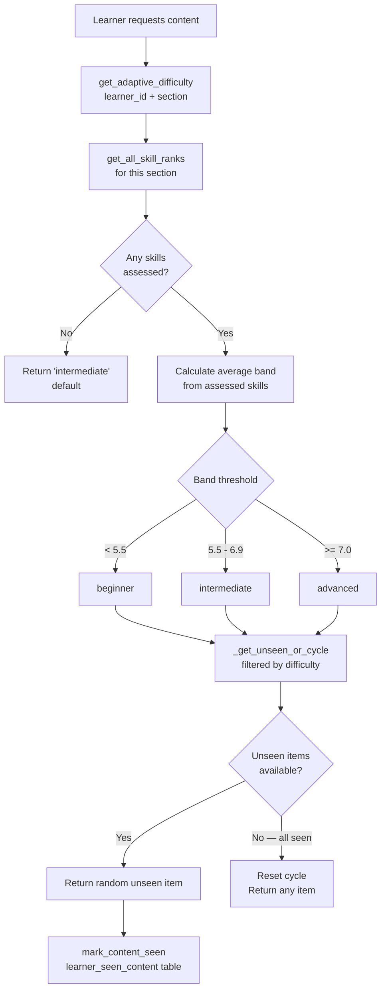

---

## Band Estimation System

IELTS band estimates (4.0–8.5) replace the internal 1-5 rank
for all learner-facing displays. The rank engine is unchanged —
bands are derived at read time from rank + streak.

```
Rank 1, streak 0 → Band 4.0   Rank 1, streak 1+ → Band 4.5
Rank 2, streak 0 → Band 5.0   Rank 2, streak 1+ → Band 5.5
Rank 3, streak 0 → Band 6.0   Rank 3, streak 1+ → Band 6.5
Rank 4, streak 0 → Band 7.0   Rank 4, streak 1+ → Band 7.5
Rank 5, streak 0 → Band 8.0   Rank 5, streak 1+ → Band 8.5

No band shown until total_evidence > 0 (first practice session)
A weakness resets streak to 0, dropping band back to base within
the rank — providing realistic downward movement without touching
the underlying rank engine.
```

Section band = average of all assessed skill bands for that section.
Overall band = average of all section bands with any evidence.

---

## Specialist Tutor State Machine

Each of the 4 specialist tutors follows the same state machine.
The Tutor is now a tool-calling agent — it can query live learner
data mid-conversation rather than relying solely on static context.

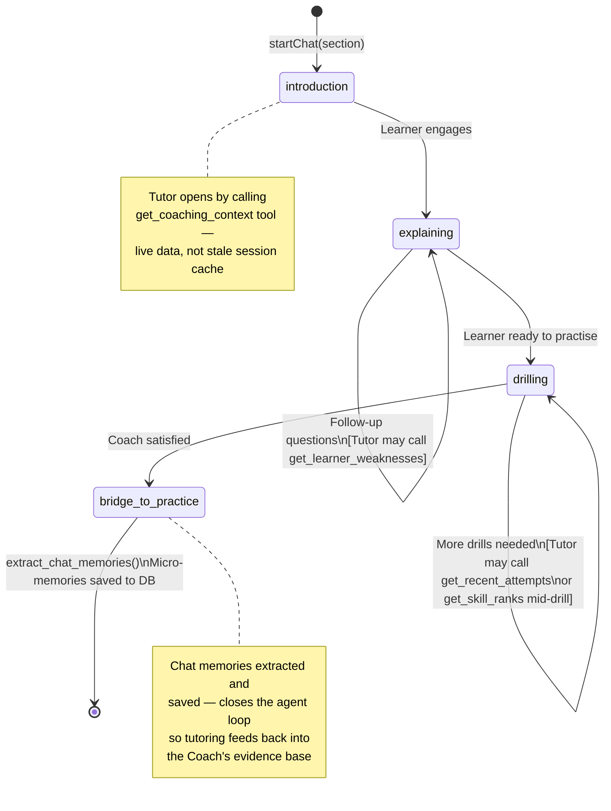

---

## Cross-Section Insights

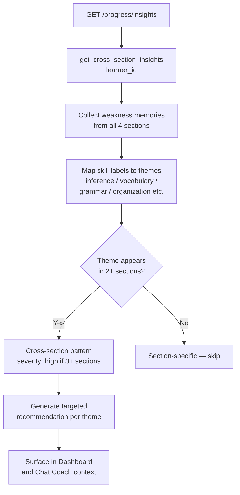

---

## OSS Audio Architecture

Listening track audio is generated once globally and
proxied to the browser via FastAPI (direct redirect cannot
be used because browsers reject cross-origin redirects
when an Authorization header is present).

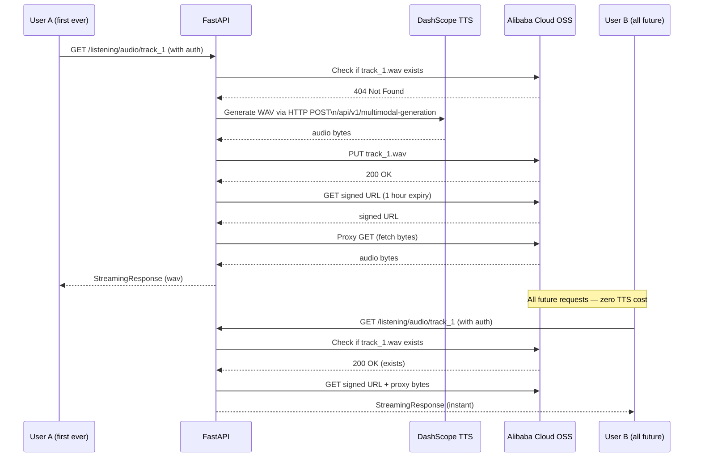

TTS quota consumed **once per track** for all users for all time.
Currently 9 tracks = 9 TTS calls total regardless of user count.

---

## Telegram Coaching Agent

The Telegram bot runs a Qwen tool-calling agent that shares the same backend
coaching functions as the web app — one implementation, two surfaces.

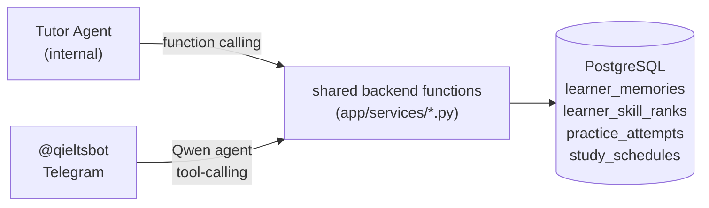

### Telegram / Qwen agent loop

```
User messages @qieltsbot
  → POST /telegram/webhook
  → resolve learner from telegram_chat_id (users table)
  → if unknown: ask for email → find_learner → store mapping
  → Qwen (qwen-plus) agentic loop, up to 5 tool-call iterations
  → reply sent via Telegram Bot API
```

The Qwen agent has access to all coaching and scheduling tools. A message like
*"What should I study and when is my next session?"* triggers
`get_coaching_context` + `get_study_schedule` in a single turn,
then Qwen synthesises both results into one reply.

### Scope guardrails

Two layers prevent the bot from being used outside IELTS coaching:

1. **Keyword pre-filter** (`api/routes/telegram.py`) — checks for ~27 blocked
   patterns (API keys, `.env`, code/script requests, jailbreak phrases) before
   any Qwen call is made. Matching messages receive a fixed refusal and the
   agent loop never starts.

2. **System prompt boundary** (`app/services/telegram_service.py`) — the Qwen
   system prompt contains a non-negotiable scope section listing exactly what
   to refuse and providing a fixed one-sentence refusal template. The same
   scope guardrail appears in all five coach/tutor prompts (`app/prompts/`).

The pre-filter handles obvious abuse cheaply; the prompt guardrail handles
subtler attempts that reach the LLM.

---

## Database Schema

```
users
  user_id, email, username, password_hash
  google_id, auth_provider, learner_id
  whatsapp_number, telegram_chat_id   ← messaging bot identity links
  is_active, created_at, last_login

learners
  learner_id, name, target_score
  test_date, current_focus

practice_attempts
  attempt_id, learner_id, section, task_type
  prompt, learner_response, score_json
  feedback, created_at

learner_memories              ← The Coach Agent's core evidence store
  memory_id, learner_id, section, skill
  memory_type (weakness/strength)
  memory_text, confidence (0.0-1.0)
  evidence_count, status (active/archived)
  embedding TEXT nullable       ← JSON-serialised 1024-d float list
  created_at, updated_at        (text-embedding-v3 via DashScope)
  ← Retrieval: hybrid semantic (cosine sim) + spaced repetition score

learner_skill_ranks           ← Deterministic rank engine store
  rank_id, learner_id, section, skill_id
  current_rank (1-5), clean_streak (0-2)
  total_evidence, last_classification
  created_at, updated_at
  ← Band (4.0-8.5) derived at read time from rank + streak

learner_seen_content          ← Adaptive content deduplication
  seen_id, learner_id, section
  content_id (passage_id / prompt_id / track_id)
  seen_at
  ← Ensures adaptive selection serves unseen content first;
    cycles back only when all items at current difficulty exhausted

mastery_scores
  Section-level score history

session_summaries
  Session-level summaries

study_schedules               ← Recurring study plan per learner
  schedule_id, learner_id
  days_of_week TEXT           ← JSON: ["Mon","Wed","Fri"]
  study_time VARCHAR(5)       ← "07:00" (HH:MM)
  duration_minutes INTEGER    ← 15 / 30 / 45 / 60
  timezone VARCHAR(60)        ← IANA e.g. "Africa/Lagos"
  google_refresh_token TEXT   ← OAuth token for Google Calendar writes
  google_calendar_event_id TEXT ← recurring event series ID
  google_email VARCHAR        ← connected Google account
  is_active BOOLEAN
  created_at, updated_at
  ← Scheduling tools (web app + Telegram) read/write this table
  ← Google Calendar events created via google-api-python-client
  ← RRULE: FREQ=WEEKLY;BYDAY=MO,WE,FR;UNTIL=<test_date>

─── Pedagogical Skill Layer tables ──────────────────────────────────────────

tutor_sessions                ← One per Tutor chat session
  session_id (UUID), learner_id, section
  current_state (introduction/explaining/drilling/bridge_to_practice)
  started_at, completed_at

learner_criterion_state       ← Support level + counters per learner/criterion
  state_id, learner_id, section, criterion_id
  support_level (full/partial/minimal/none)
  recent_successes, recent_failures, average_hint_level
  independent_accuracy, last_support_change
  ← Mutated only by coach_tutor_session() via fading guardrail

tutor_session_plans           ← Persisted PedagogyPlan for each session
  session_plan_id, session_id, learner_id, section
  target_skill, target_criterion, target_descriptor
  current_stage, dominant_framework, supporting_frameworks_json
  support_level, practice_conditions_json
  feedback_priorities_json, exit_criteria_json
  outcome, completed_at

pedagogical_events            ← One row per [ACTION:] tag parsed from Tutor output
  event_id, session_id, learner_id
  event_type (hint/attempt/model_shown/feedback_given/independent_check/complete)
  event_data_json, created_at
  ← Best-effort evidence: a missing tag loses a data point, never breaks the chat

hint_events                   ← One row per hint given
  hint_id, session_id, learner_id
  hint_level (1-4), self_corrected (bool)
  created_at
  ← self_corrected = True if learner repaired without hint in same turn
```

---

## Data Persistence

Learner data is stored in **PostgreSQL 16**, running as a separate Docker
service in both dev and prod compose files. Data survives container rebuilds
because the `postgres_data` named volume is retained.

```
docker compose down && docker compose up --build
  → postgres_data volume retained → all tables unchanged → all learner data preserved

docker compose down -v
  → volume deleted → data lost (only use this intentionally)
```

### Entrypoint startup sequence (prod)

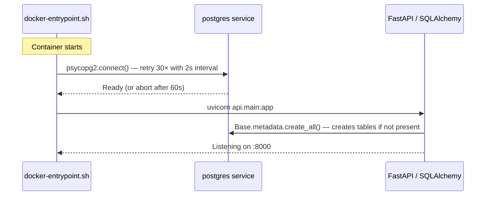

`DATABASE_URL` is an environment variable — both compose files inject the
PostgreSQL connection string. `app/db/database.py` detects `sqlite://` vs
`postgresql://` and sets `connect_args` accordingly, so local development
without Docker still works against a file-based SQLite database by default.

### Migrating from legacy SQLite

If upgrading from a previous SQLite-only deployment:

```bash
# While postgres container is running and healthy:
python scripts/migrate_sqlite_to_postgres.py \
    --sqlite ./ielts_coach.db \
    --postgres "postgresql://ielts:<password>@localhost:5432/ielts_coach"
```

The script is idempotent (`INSERT ... ON CONFLICT DO NOTHING`) and migrates
all 13 tables. Safe to re-run if interrupted.

---

## Scripts

| Script | Purpose |
|---|---|
| `scripts/migrate_sqlite_to_postgres.py` | One-time idempotent migration from legacy SQLite to PostgreSQL. Reads all rows from every table and inserts with `ON CONFLICT DO NOTHING`. Safe to re-run. |
| `scripts/db_backup.py` | OSS backup/restore for SQLite deployments (legacy path). The PostgreSQL `postgres_data` volume makes this unnecessary in production, but the script is retained for operators who prefer SQLite locally. |
| `scripts/eval_pedagogy.py` | Offline evaluation harness for ACTION tag reliability and stage-routing correctness. Requires real session data to run meaningfully. |

---

## Key Design Decisions

### 1. Coach/Tutor separation
Two agents with a clean boundary: **Coach writes, Tutor reads**.
The Coach evaluates practice submissions, classifies skills via
`submit_classification`, and writes memories via `write_memory`.
The Tutor reads learner data via read-only tools and never writes
ranks or memories directly. This boundary is enforced by separate
tool schemas (`COACH_TOOL_SCHEMAS` vs `TUTOR_TOOL_SCHEMAS`).

### 2. Deterministic rank engine beneath the Coach agent
The Coach agent makes AI judgements (classify this skill as
strength/weakness), but rank changes are always decided by the
deterministic engine (3 consecutive strengths = rank up). The AI
judges the evidence; the engine enforces the rules. Rank changes
are fully auditable — inspect `learner_skill_ranks` to see exactly
why any rank moved.

### 3. Three separate Qwen calls per Writing submission
Isolation by design. Essay evaluation (qwen-plus), skill
classification (qwen-turbo), and memory extraction (qwen-plus)
are separate. Long feedback contains apostrophes that break JSON
parsing; short classification responses are reliable. One failure
cannot cascade.

### 4. Task-tiered model routing
```
qwen-plus     → complex reasoning (essay evaluation, memory
                 extraction, Coach agent, Tutor agent)
qwen-turbo    → structured output (skill classification,
                 JSON repair) — faster, cheaper, sufficient
qwen-vl-plus  → vision (handwritten essay image extraction)
```

### 5. OSS for audio
Listening track audio is generated once globally.
Every learner gets it proxied from Alibaba Cloud OSS instantly.
TTS quota consumed exactly once per track for all users for all time.

### 6. One tool layer, three consumers
The coaching tool functions (`app/services/`) are called by two
consumers: the **Tutor agent** (Qwen function calling, internal) and the
**Telegram Qwen agent** (tool-calling, `telegram_service.py`). One Python
implementation, zero duplication. Adding a new tool immediately makes it
available to all three surfaces.

### 7. SSE streaming for essay feedback
The learner sees the first feedback token in ~1-2 seconds
instead of waiting 15-20 seconds. FastAPI StreamingResponse
with Nginx `proxy_buffering off` ensures tokens flow
through to the browser without buffering.

### 8. Adaptive content with seen-content deduplication
All four sections select content matched to the learner's average
band. `learner_seen_content` tracks which items have been served
so the same passage/prompt/track is never repeated until all
items at the current difficulty level have been exhausted.

### 9. Spaced repetition in memory retrieval
`get_relevant_memories()` weights memories by `confidence ×
recency_weight`. A memory updated last week outranks a
higher-confidence memory from three months ago — matching
the spaced repetition principle that recent evidence is more
predictive of current ability.

### 10. Hybrid semantic + spaced-repetition retrieval
When the Pedagogy Planner builds a session plan it passes the target
band descriptor (e.g. "uses a range of cohesive devices appropriately")
as a context string to `get_relevant_memories()`. The service embeds
the context (DashScope `text-embedding-v3`, 1024-d) and re-ranks
memories with `0.45 × cosine_similarity + 0.55 × SR_score`.

This gives the Tutor the memories most relevant to *what is being
taught today*, not just the most recently updated ones. Embeddings
are stored as JSON-serialised float lists in the `embedding` column;
cosine similarity is computed in Python (numpy) — no pgvector or
separate vector store is needed at IELTS coaching scale (typically
20–200 memories per learner). When no context is provided (e.g.
calls with no session context) the system falls back to pure spaced-repetition
ranking, so existing integrations are unaffected.

### 11. OSS pre-signed URLs for Qwen VL image input
DashScope's VL endpoint only accepts `https://` URLs — base64 data URIs are
rejected with a 400. Handwritten essay images are uploaded to a private OSS
object, a 5-minute pre-signed GET URL is generated (`bucket.sign_url`), and
that URL is passed to `qwen-vl-plus`. The temporary object is deleted in a
`finally` block regardless of success or failure. No public-read ACL is
required; the pre-signed URL gives Qwen time-limited access only.

### 12. PKCE for Google Calendar OAuth
Google requires PKCE for all OAuth flows (web server applications included).
`get_auth_url()` generates a `code_verifier`, derives the `S256` challenge,
and encodes the verifier inside the `state` parameter (base64 JSON). The
callback decodes `state`, extracts the verifier, and passes it to
`flow.fetch_token(code_verifier=...)`. This keeps the flow fully stateless —
no server-side session storage needed for the verifier.

### 13. PostgreSQL as the production database
PostgreSQL 16 runs as a separate Docker service with a named volume.
Benefits over the former SQLite approach:
- **Concurrent writes** — uvicorn's 2-worker setup hits a real connection
  pool instead of a single file lock
- **Production migration path** — standard PostgreSQL tooling (pg_dump,
  logical replication, managed RDS) works without any code changes
- **Readiness gate** — the entrypoint retries `psycopg2.connect()` up to
  30 times before starting FastAPI, so a cold ECS boot never hits a
  "database not ready" error
`DATABASE_URL` remains env-var driven so SQLite still works for local
development without Docker.
