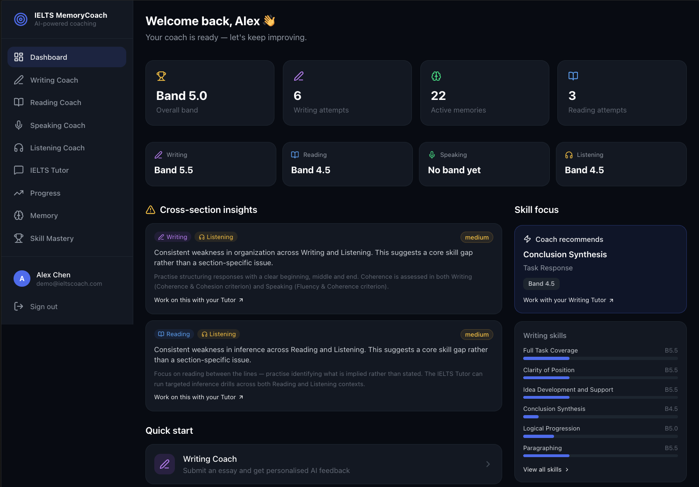
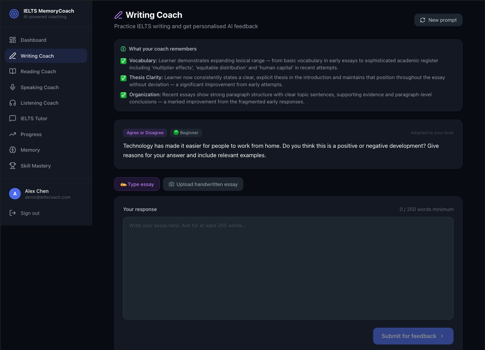
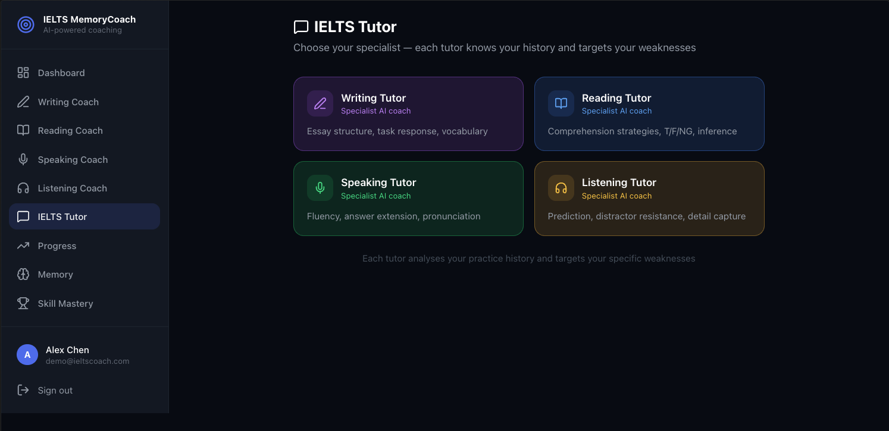
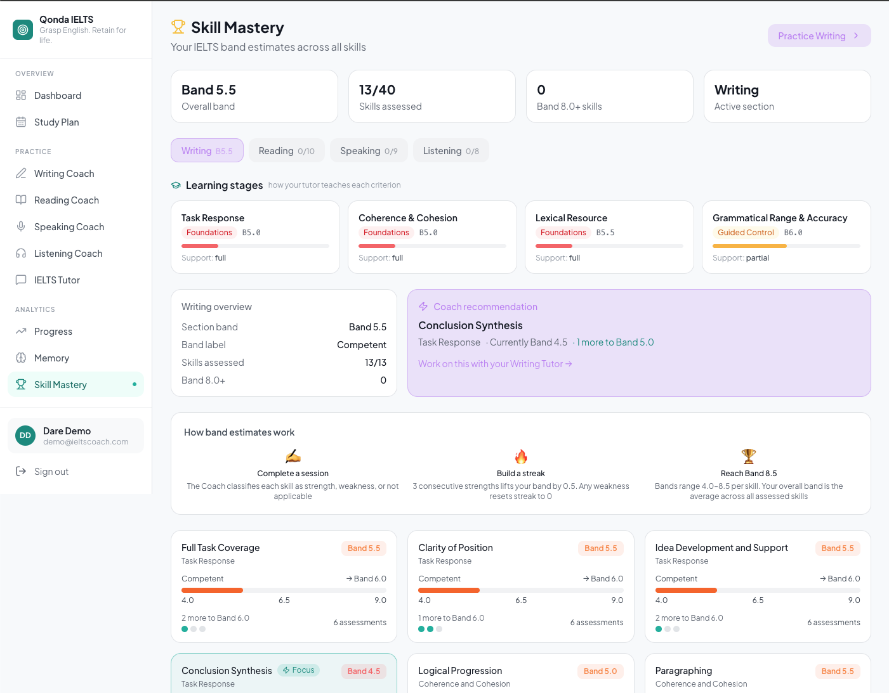
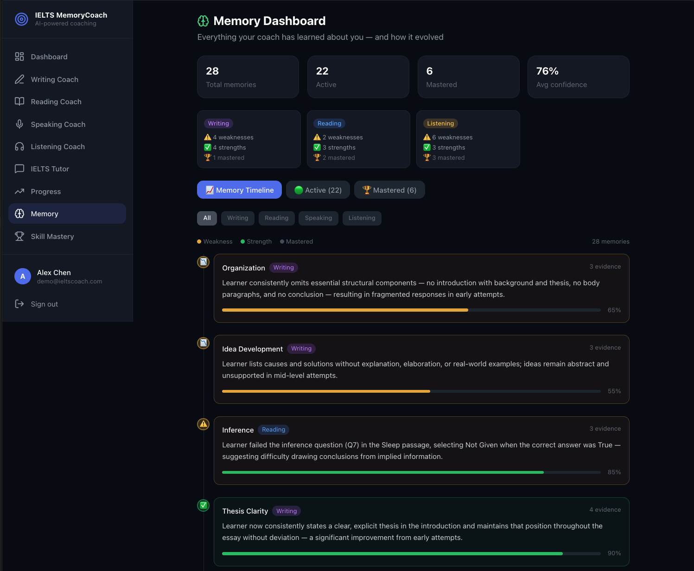
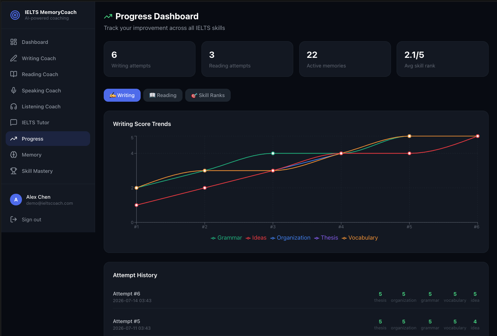

# 🎯 IELTS MemoryCoach

> An AI agent that remembers every learner and gets smarter with every session.

**Live Demo:** http://47.84.184.65  
**Demo Login:** demo@ieltscoach.com / demo1234

---

## The Problem

3.5 million people take IELTS every year. Most of them are not students — they are **working professionals** who need a Band 6.5 or 7.0 to unlock a visa, a job offer, or a university place. They study in stolen hours: on a commute, in a lunch break, after the kids are in bed.

Every existing prep tool has the same fundamental flaw: **it forgets you between sessions.** You get generic feedback today, generic feedback tomorrow, and no cumulative coaching intelligence. A tool that doesn't remember what you struggled with last week cannot make you better this week.

| Feature | MemoryCoach | British Council | Magoosh | IELTS.org |
|---|---|---|---|---|
| Persistent memory across sessions | ✅ | ❌ | ❌ | ❌ |
| Granular skill rank engine | ✅ | ❌ | ❌ | ❌ |
| Specialist AI tutors per section | ✅ | ❌ | Partial | ❌ |
| MCP API for external agents | ✅ | ❌ | ❌ | ❌ |
| All 4 IELTS skills | ✅ | ✅ | ✅ | ✅ |
| Built on Alibaba Cloud | ✅ | ❌ | ❌ | ❌ |

MemoryCoach solves this with a **persistent AI memory layer** — every practice session extracts coaching insights that strengthen, weaken and archive over time, building an ever-richer model of each learner.

---

## The Agent Architecture

MemoryCoach implements a full **perceive → remember → reason → act** agent loop that runs after every practice session:

```
PERCEIVE   Essay submitted / audio recorded / passage answered
           ↓
           Qwen evaluates against official IELTS rubrics
           ASR transcribes spoken responses (qwen3-asr-flash)

REMEMBER   MemoryAgent extracts coaching observations
           Updates learner_memories with confidence scoring
           Strengthens confirmed patterns, weakens contradicted ones
           Archives mastered weaknesses permanently
           Updates learner_skill_ranks via deterministic rule engine

REASON     Specialist tutor builds session context:
           → Fetches weakest skill from learner_skill_ranks
           → Retrieves evidence memory for that skill
           → Pulls recent essay excerpt from practice_attempts
           → Assembles personalised context brief

ACT        Specialist AI tutor opens a targeted lesson
           References the learner's actual writing/speech
           Generates focused drills for the specific weakness
           Bridges back to practice when ready
```

This loop runs silently after every submission — the learner simply sees better and more personalised coaching with each session.

---

## Custom AI Skills

MemoryCoach implements four **custom AI skills** — domain-specific agent configurations with specialist knowledge, teaching strategies, and internal state machines:

| Custom Skill | Specialist Knowledge | State Machine |
|---|---|---|
| Writing Tutor | IELTS Band Descriptors, task types, thesis structure, cohesion | introduction → explaining → drilling → bridge_to_practice |
| Reading Tutor | T/F/NG strategy, skimming, scanning, paraphrase recognition | introduction → explaining → drilling → bridge_to_practice |
| Speaking Tutor | Part 1/2/3 strategies, OREO structure, circumlocution | introduction → explaining → drilling → bridge_to_practice |
| Listening Tutor | Prediction, distractor resistance, form completion | introduction → explaining → drilling → bridge_to_practice |

Each skill uses hidden `[STATE: xxx]` tags for deterministic UI state tracking — the learner experiences natural conversation while the system reliably knows when to show the "Go practise" button.

---

## Screenshots

### Dashboard — overall band, cross-section insights, skill focus


### Writing Coach — adaptive prompts, streaming feedback, handwritten essay upload


### IELTS Tutor — specialist AI tutor grounded in real evidence


### Skill Mastery — IELTS band estimates across all skills


### Memory Timeline — the MemoryAgent's learning made visible


### Progress Dashboard — score trends and skill improvements


---

## What it does

IELTS MemoryCoach is a full-stack AI coaching web application that remembers learners across sessions. Unlike static quiz tools, it tracks weaknesses, monitors improvement, personalises feedback over time, and actively teaches learners through specialist AI tutors grounded in their own practice evidence.

**Core features:**
- Google OAuth and username/password authentication with JWT sessions
- Real IELTS practice content for all four skills (9 reading passages,
  9 listening tracks, 15 speaking prompts, 7 writing prompts)
- **Adaptive content** — difficulty matched to learner's current band level
- **No-repeat selection** — seen content avoided until all exhausted
- AI-powered scoring using official IELTS rubrics and band descriptors
- Persistent memory with **spaced repetition weighting** — recency × confidence
- **Coach Agent** — evaluates practice via tool calls, classifies skills,
  writes memories; backed by deterministic rank engine
- **Tutor Agent** — calls live tools mid-conversation, extracts micro-memories
  at session end to close the agent loop
- **Cross-section insights** — identifies skill gaps that span multiple sections
- **IELTS band estimates (4.0–8.5)** per skill, updated after every session
- **Handwritten essay upload** — qwen-vl-plus extracts text from photos
- Skill taxonomy for all 4 sections: Writing (13), Reading (10),
  Speaking (9), Listening (8) sub-skills
- Memory layer exposed as MCP server for external agent consumption
- Streaming essay feedback (SSE) — first token in ~1-2 seconds
- TTS audio cached in Alibaba Cloud OSS (generated once per track, served forever)
- Progress dashboard with score trends and band estimates across all four skills
- Memory timeline showing coaching intelligence evolution over time

---

## Tech stack

| Layer | Technology |
|---|---|
| Frontend | React (Vite) + Tailwind CSS |
| Backend API | FastAPI (Python) |
| AI text inference | Alibaba Cloud Model Studio (qwen-plus, qwen-turbo, qwen-vl-plus) |
| Speech-to-Text | DashScope qwen3-asr-flash |
| Text-to-Speech | DashScope qwen3-tts-flash (Cherry voice) |
| Audio storage | Alibaba Cloud OSS (oss-ap-southeast-1) |
| Agent protocol | MCP (Model Context Protocol) via FastMCP |
| Compute | Alibaba Cloud ECS (Singapore) |
| Auth | JWT + Google OAuth (Authlib) |
| Database | SQLite via SQLAlchemy |
| Containerisation | Docker + Docker Compose |
| Reverse proxy | Nginx |

**No agent framework** — all orchestration is hand-rolled Python with deterministic logic where it matters. The rank engine never uses AI for decisions.

---

## Alibaba Cloud services

```
Model Studio    — text + vision AI inference
                  qwen-plus  → essay evaluation, memory extraction,
                               Coach agent, Tutor agent
                  qwen-turbo → skill classification (fast, cheap)
                  qwen-vl-plus → handwritten essay image extraction
                  70M+ free tokens, Singapore region workspace

DashScope ASR   — qwen3-asr-flash, real-time speech transcription
                  Automatic compression + chunking for long recordings

DashScope TTS   — qwen3-tts-flash, Cherry voice
                  Listening track audio cached in OSS permanently

OSS             — ielts-memorycoach-audio bucket, Singapore
                  TTS audio generated once, served to all users forever
                  Zero DashScope cost after first generation per track

ECS             — ecs.e-c1m2.large, Singapore Zone A
                  Docker + Nginx, 2 vCPU 4GB RAM

VPC + Security  — isolated network, principle of least privilege
```

---

## IELTS modules

### ✍️ Writing Coach
- Adaptive prompts matched to learner's current band level
- **Handwritten essay upload** — photograph your essay, qwen-vl-plus
  extracts the text, same evaluation pipeline runs
- Evaluated against 5 official rubric criteria
- Coach Agent classifies 13 granular sub-skills via tool calls
- Streaming feedback via SSE (first token ~1-2s)
- Full memory lifecycle + skill rank updates

### 📖 Reading Coach
- 9 passages across 3 difficulty levels (3 per level)
- Adaptive selection — passage difficulty matched to current band
- Multiple Choice, True/False/Not Given, Short Answer
- Objective answers checked instantly, short answers via Qwen
- No-repeat selection — seen passages avoided until all exhausted
- Full memory lifecycle + Coach Agent skill classification

### 🎤 Speaking Coach
- 15 prompt sets (5 beginner, 6 intermediate, 4 advanced)
- Adaptive selection — prompt difficulty matched to current band
- Browser microphone recording or file upload
- qwen3-asr-flash transcription in real time
- Cherry reads examiner feedback aloud via TTS
- Band scores: Fluency, Lexical, Grammar, Pronunciation
- No-repeat selection — seen prompts avoided until all exhausted
- Coach Agent classifies 9 Speaking sub-skills after each session

### 🎧 Listening Coach
- 9 tracks across 3 difficulty levels (3 per level), all 4 IELTS parts
- Adaptive selection — track difficulty matched to current band
- Cherry generates audio on first request, cached in OSS permanently
- Audio proxied via FastAPI (handles auth + cross-origin correctly)
- Exam conditions: preview questions, play once, answer while listening
- Fuzzy answer matching for spelling/number variants
- No-repeat selection — seen tracks avoided until all exhausted
- Coach Agent classifies 8 Listening sub-skills after each session

### 🧑‍🏫 IELTS Tutor (Chat Coach)
- 4 specialist tutors — select your section
- **True agent loop** — Tutor calls live tools mid-conversation:
  get_learner_weaknesses, get_recent_attempts, get_skill_ranks
- Each tutor opens with live context from the Coach Agent, not
  stale session-start data
- When drilling concludes, micro-memories are extracted and saved —
  closing the agent loop so tutoring feeds back into future coaching
- Internal state machine behind natural conversation
- Session cached in browser — no redundant API calls on navigation

---

## Skill Mastery System

Skills are displayed as **IELTS band estimates (4.0–8.5)** rather than
internal ranks. Bands are derived from the rank engine at read time:
streak 0 = base band for that rank; streak 1+ = base band + 0.5.
A weakness (streak reset) drops the band back to base — realistic
downward movement without destabilising the underlying engine.
No band is shown until the learner completes their first practice session.

### 13 Writing sub-skills (Official IELTS Band Descriptors)

| Category | Sub-skills |
|---|---|
| Task Response | Full Task Coverage, Clarity of Position, Idea Development, Conclusion Synthesis |
| Coherence & Cohesion | Logical Progression, Paragraphing, Cohesive Devices |
| Lexical Resource | Vocabulary Range, Word Choice Precision, Spelling & Word Formation |
| Grammatical Range & Accuracy | Sentence Variety, Grammatical Accuracy, Punctuation Control |

### Rank engine (deterministic — no AI in rank decisions)

```
After each submission, the Coach Agent gathers evidence via tools,
then calls submit_classification for each skill in the taxonomy:

  "demonstrated_strength"  → clean_streak += 1
  "demonstrated_weakness"  → clean_streak = 0  (full reset)
  "not_applicable"         → no change

clean_streak reaches 3     → current_rank += 1 (max 5)
Band estimate derived at read time from rank + streak (4.0–8.5)
Rank NEVER decreases automatically.
All rank changes are auditable in learner_skill_ranks table.
Supported for all 4 sections: Writing (13), Reading (10),
Speaking (9), Listening (8) sub-skills.
```

---

## MCP Server

The MemoryCoach memory layer is exposed as an MCP server at `/mcp-server/mcp`. Any MCP-compatible AI agent can query learner coaching data:

```python
# Example: external tutoring agent queries MemoryCoach
async with Client(mcp) as client:
    context = await client.call_tool(
        'get_coaching_context',
        {'learner_id': 'abc123', 'section': 'Writing'}
    )
    # Returns: weakest skill, top weaknesses, skill ranks,
    #          memory stats, sessions to next rank-up
```

**Available tools:**
- `get_coaching_context` — full context bundle for AI tutoring agents
- `get_learner_weaknesses` — active weakness memories with confidence
- `get_learner_strengths` — active strength memories
- `get_skill_ranks` — all skill ranks with streak data
- `get_weakest_skill_for_learner` — single weakest skill with rank definitions
- `get_recent_attempts` — attempt history with score summaries
- `get_learner_memory_stats` — memory profile statistics

**Use cases:** School dashboards, external tutoring platforms, analytics pipelines, research tools — any MCP-compatible agent can consume a learner's coaching history without direct database access.

---

## Getting started

### Prerequisites
- Docker + Docker Compose
- DashScope API key (https://dashscope-intl.aliyuncs.com)

### Run locally

```bash
git clone https://github.com/DareAdekunle/IELTS-memoryCoach.git
cd IELTS-memoryCoach
cp .env.example .env
# Fill in your DASHSCOPE_API_KEY and JWT_SECRET
docker compose -f docker-compose.prod.yml up --build
```

Open http://localhost

### Seed demo data

```bash
docker cp seed_demo.py ielts-memorycoach:/app/seed_demo.py
docker exec ielts-memorycoach python seed_demo.py
```

---

## Project structure

```
IELTS-memorycoach/
├── api/                    ← FastAPI backend
│   ├── auth/               ← JWT + Google OAuth
│   └── routes/             ← writing, reading, speaking,
│                              listening, chat, progress, memory
├── app/                    ← Python services (AI + business logic)
│   ├── services/           ← scoring, memory, tts, asr, mcp
│   ├── prompts/            ← Qwen prompt templates (4 tutor skills)
│   ├── data/               ← IELTS content + skill taxonomies
│   ├── db/                 ← SQLAlchemy models + migrations
│   ├── mcp/                ← MCP server (FastMCP)
│   └── utils/              ← JSON parser, logger, scoring helpers
├── frontend/               ← React app (Vite + Tailwind)
│   └── src/
│       ├── api/            ← axios clients per module
│       ├── components/     ← AppShell, ProtectedRoute
│       └── pages/          ← one page per module
├── Dockerfile              ← multi-stage: React build + Python + Nginx
├── docker-compose.prod.yml ← production orchestration
├── nginx.conf              ← reverse proxy + SSE support
├── seed_demo.py            ← demo account seeder
├── ARCHITECTURE.md         ← system design + agent loop
└── CLAUDE.md               ← agent build harness
```

---

## Who this is for

3.5 million people take IELTS every year. Most of them are not students — they are **working professionals** in Lagos, Nairobi, Manila, Dhaka, and dozens of other cities who need a Band 6.5 or 7.0 to unlock a visa, a job offer, or a university place in an English-speaking country.

They cannot attend classes. They study on their phone during a commute, in a lunch break, or at 10pm after the kids are in bed. Existing tools give them the same generic feedback every session with no memory of what they worked on last week. MemoryCoach is built for them — an AI coach that learns who they are and gets smarter every time they practise, fitting around a full-time life rather than demanding they rearrange it.

## Productization roadmap

```
Phase 1 (current) — Solo practitioner web app
  ✅ All 4 IELTS skills with persistent AI memory
  ✅ Band estimates (4.0–8.5) per skill, updated after every session
  ✅ Adaptive content — difficulty matched to current band level
  ✅ Specialist AI tutors grounded in real practice evidence
  ✅ Cross-section insights — identifies core gaps across skills
  ✅ MCP server — memory layer accessible to external agents
  ✅ Handwritten essay upload via qwen-vl

Phase 2 — Mobile-first consumer product
  ⬜ React Native app (same FastAPI backend, zero re-architecture)
  ⬜ Push notifications: "You haven't practised Writing in 3 days"
  ⬜ Study schedule builder — practice reminders around work hours
  ⬜ Offline mode — download practice content, sync results later
  ⬜ Streak tracking and milestone celebrations
  ⬜ Voice selection for TTS — learners choose their examiner accent
     (British, American, Australian) to practise with the accent
     they will face in their actual test

Phase 3 — Freemium at scale
  ⬜ Free tier: 5 sessions/month, memory limited to last 3 sessions
  ⬜ Premium: $9.99/month — unlimited sessions, full persistent memory,
     all 4 sections, complete band history
  ⬜ Target price point is globally accessible — less than one prep book
  ⬜ PostgreSQL migration for multi-region scale
  ⬜ Payment via Stripe (card) + regional methods (M-Pesa, GCash, UPI)

Phase 4 — Community and accountability
  ⬜ Anonymous band leaderboards by target score and country
  ⬜ Study groups — 2-3 learners compare progress and hold each other
     accountable (the most powerful retention mechanism for adult learners)
  ⬜ Milestone sharing — "I just hit Band 6.5 on Writing 🎉"
  ⬜ Referral programme — one month free for each friend who reaches
     their target band

Phase 5 — Platform
  ⬜ Public MCP API — licensed IELTS tutors query a learner's full
     coaching profile (with consent) and pick up exactly where the
     app left off; MemoryCoach becomes infrastructure for the broader
     IELTS prep ecosystem
  ⬜ Taxonomy contribution — community validates and extends skill
     definitions; open-source core, hosted service
  ⬜ Webhook system — notify integrations when a learner hits their
     target band
```

**Business model:** Freemium direct-to-consumer. Free tier drives acquisition at scale across emerging markets. Premium at $9.99/month converts the motivated — a learner spending $250 on an IELTS test fee will pay $10/month for a coach that actually remembers them. MCP API access for third-party tutoring platforms provides a B2B revenue layer without the complexity of institutional sales cycles.

---

## Key design decisions

**1. No agent framework** — LangChain/LlamaIndex were evaluated and rejected. Every pipeline is a fixed, known sequence. A framework adds abstraction cost with no benefit when there's no dynamic tool selection.

**2. Deterministic rank engine** — AI classifies (strength/weakness/not_applicable), Python counts to three and ranks up. Rank changes are auditable, tamper-proof and explainable.

**3. Three separate Qwen calls per Writing submission** — essay evaluation (qwen-plus), skill classification (qwen-turbo), memory extraction (qwen-plus) are separate by design. Long feedback responses contain apostrophes that break JSON parsing. Isolation means one failure cannot cascade to the others.

**4. OSS for audio** — Listening track audio is generated once globally and stored in Alibaba Cloud OSS. Every learner gets it from OSS instantly. The TTS quota is consumed exactly once per track for all users for all time — adding a new track costs one TTS call regardless of how many learners use it.

**5. MCP as the memory API** — exposing the memory layer as MCP means any compatible agent can query learner coaching history without database access. The MemoryCoach memory becomes infrastructure, not just an app feature.

---

## Roadmap

- [x] Auth — Google OAuth + username/password + JWT
- [x] Writing Coach — essay, AI scoring, streaming SSE
- [x] Reading Coach — passages, questions, results
- [x] Speaking Coach — ASR + TTS + 3-part session
- [x] Listening Coach — TTS audio + OSS caching
- [x] IELTS Tutor — 4 specialist AI tutors
- [x] Writing skill taxonomy (13 sub-skills, Band Descriptors)
- [x] Deterministic rank engine
- [x] Memory Timeline visualization
- [x] Skill Mastery dedicated page
- [x] MCP server (7 tools)
- [x] Alibaba Cloud deployment (ECS + OSS + Model Studio)
- [ ] Extend taxonomy to Reading, Speaking, Listening
- [ ] Chat Coach writes memories after drilling
- [ ] Adaptive prompt difficulty
- [ ] Teacher / admin dashboard
- [ ] PostgreSQL for multi-school scale
- [ ] Video walkthrough
